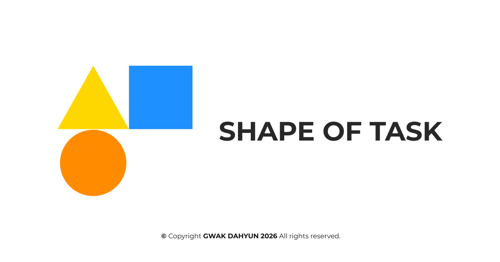

# SHAPE OF TASK



할 일의 중요도를 도형으로 시각화해 관리하는 React 기반 일정 관리 웹 앱
 
**웹사이트**: [shape-of-task.vercel.app](https://shape-of-task.vercel.app)
 
## 기술 스택
 
| 분류 | 기술 |
|------|------|
| Frontend | React 19, TypeScript, styled-components |
| 상태/데이터 | Redux Toolkit, React-Redux, RTK Query |
| 라우팅 | React Router |
| 빌드 도구 | Vite 6, SVGR |
| 스토리지 | localStorage + persist middleware |
| 이미지 저장 | html2canvas, file-saver |
| 외부 API | API Ninjas(명언), DeepL(번역) |
 
## 아키텍처
 
```
[React UI]
  ├─ Pages / Components / Styled Components
  ├─ Hooks (useTodaysQuote, useBreakpoint, ...)
  └─ Router (mobile)
          │
          ▼
[Redux Toolkit Store]
  ├─ taskListSlice
  ├─ themeChangeSlice
  ├─ modalSlice
  ├─ priorityLabelsSlice
  └─ RTK Query apiSlice (quotesApi)
          │
          ├─ localStorage persist middleware
          ├─ External API: API Ninjas (quote)
          └─ Internal API: /api/translate (DeepL proxy)
```
 
### 화면 구조
 
| 경로 | 설명 |
|------|------|
| `/` | 메인 (오늘의 명언 + 모양 통계) |
| `/task-list` | 할 일 목록 (추가·수정·삭제·정렬·필터) |
| `/shape-list` | 완료된 도형 목록 + 이미지 저장 |
 
> Desktop(≥768px)에서는 세 화면을 3열로 동시 표시합니다.
 
### API 엔드포인트
 
| 엔드포인트 | 설명 |
|-----------|------|
| `POST /api/translate` | DeepL 번역 프록시 (명언 한국어 변환) |
 
## 로컬 실행
 
### 요구사항
 
- Node.js 24.x (`package.json` engines 기준)
- Yarn
 
### 설치 및 실행
 
```bash
git clone https://github.com/DaH-115/shape-of-task.git
cd shape-of-task
yarn install
# .env.local 파일 생성 후 아래 환경변수 항목 채우기
yarn dev
```
 
### 빌드 / 프로덕션 실행
 
```bash
yarn build
yarn preview
```
 
## 환경변수
 
`.env.local` 파일에 아래 항목을 설정하세요.
 
```bash
# API Ninjas (클라이언트에서 사용)
VITE_APP_API_NINJAS_KEY=your_api_ninjas_key
 
# DeepL (서버리스/개발 플러그인에서 사용)
DEEPL_API_KEY=your_deepl_api_key
```
 
> `DEEPL_API_KEY`는 서버 측에서만 사용되며 브라우저 번들에 직접 노출되지 않습니다.
 
## 디렉토리 구조
 
```
├── api/
│   └── translate.ts              # DeepL 번역 서버리스 핸들러
├── public/                       # 정적 파일 (파비콘, OG 이미지 등)
├── src/
│   ├── assets/                   # SVG 아이콘
│   ├── components/               # 재사용 UI (버튼, 모달, 도형, 메뉴, 명언)
│   ├── hooks/                    # 커스텀 훅
│   ├── layout/                   # Header / Footer / ResponsiveLayout
│   ├── pages/                    # MainPage, TaskListPage, ShapeListPage
│   ├── routes/                   # 모바일 라우트 정의
│   ├── services/                 # API 호출 유틸 (translate)
│   ├── store/                    # Redux slices, RTK Query, persist middleware
│   ├── styles/                   # 글로벌 스타일, 테마 토큰
│   ├── types/                    # 전역 타입
│   └── utils/                    # localStorage, 캡처 등 공용 유틸
└── vite-plugin-translate-api.ts  # 개발용 /api/translate 미들웨어
```
 
## 배포
 
Vercel 배포 기준으로 구성되어 있습니다. 환경변수를 Vercel 프로젝트 설정에 동일하게 등록하면 됩니다.
 
## 라이선스
 
개인 포트폴리오 및 학습 목적 프로젝트입니다.
